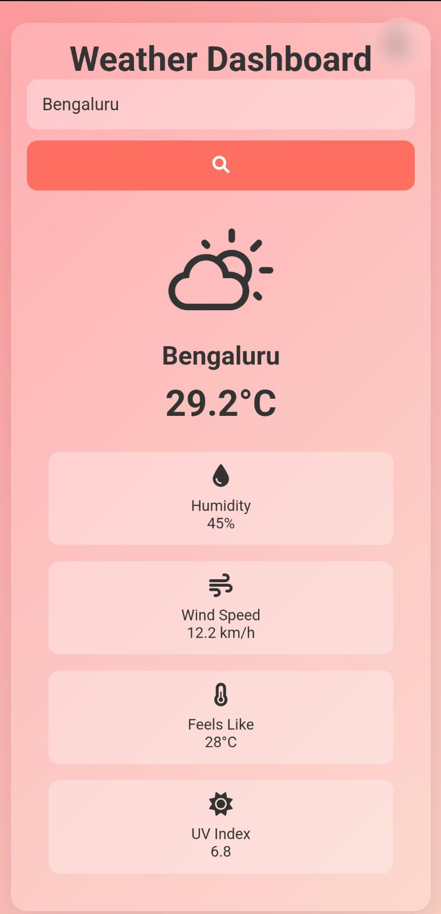

# SkyFlicker 🌤️

SkyFlicker is a **modern, animated, and visually stunning weather app** that provides real-time weather updates with dynamic backgrounds and a user-friendly interface. Built with **HTML**, **CSS**, and **JavaScript**, this app is designed to make checking the weather a delightful experience.

---

## Features ✨
- **Real-Time Weather Data**: Fetches live weather data using the [WeatherAPI](https://www.weatherapi.com/).
- **Dynamic Backgrounds**: Background animations change based on the weather condition (sunny, rainy, cloudy, snowy).
- **Autocomplete Search**: Easily search for cities with autocomplete suggestions.
- **Weather Details**: Displays temperature, humidity, wind speed, and weather condition.
- **Mobile-Friendly**: Fully responsive design for seamless use on all devices.

---

## Screenshots 📸

### Light Mode
.jpg)

### Dark Mode
.jpg)

### Mobile View

---

## How to Use 🚀
1. **Visit the Live Demo**: [SkyFlicker Live Demo](https://kshamaybharadwaj.github.io/SkyFlicker/)
2. **Search for a City**: Enter a city name in the search bar and press "Search" to view the weather details.
3. **Explore Weather Data**: View temperature, humidity, wind speed, and weather condition in a visually appealing format.

---

## Technologies Used 💻
- **HTML**: Structure of the app.
- **CSS**: Styling and animations.
- **JavaScript**: Fetching weather data and dynamic updates.
- **WeatherAPI**: Real-time weather data.
- **Weather Icons**: [Weather Icons](https://erikflowers.github.io/weather-icons/) for dynamic weather icons.

---

## Customization 🛠️
- **API Key**: Replace the `apiKey` variable in `script.js` with your own API key from [WeatherAPI](https://www.weatherapi.com/).
- **Colors**: Customize the colors in `style.css` to match your preferences.
- **Animations**: Modify or add new animations in the CSS file.

---

## Contributing 🤝
Contributions are welcome! If you'd like to improve SkyFlicker, follow these steps:
1. Fork the repository.
2. Create a new branch (`git checkout -b feature/your-feature`).
3. Commit your changes (`git commit -m 'Add some feature'`).
4. Push to the branch (`git push origin feature/your-feature`).
5. Open a pull request.

---

---

## Credits 🙏
- **WeatherAPI**: For providing real-time weather data.
- **Weather Icons**: For the beautiful weather icons.
- **Font Awesome**: For the toggle and search icons.

---

Enjoy the weather with SkyFlicker! 🌈
